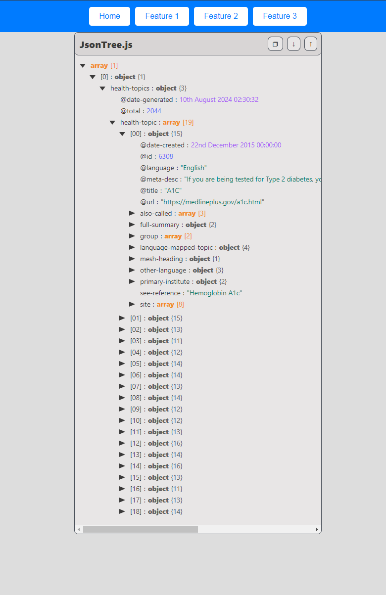
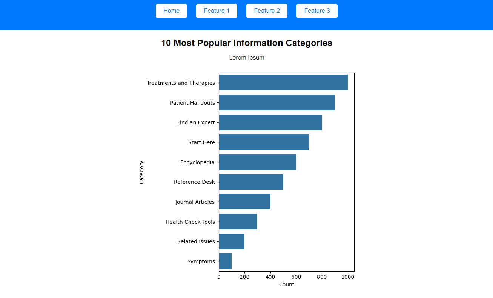
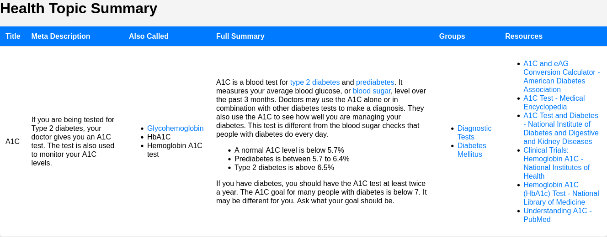

# CI-0124-TP1

## Build Instructions

Assuming that you use Linux or UNIX-like operating system:
1. Open a terminal on `TP1/Avance1` directory
1. Create a virtual environment
	```bash
	$ python3 -m venv venv
	```
1. Activate virtual environment
	```bash
	$ source venv/bin/activate
	```
1. Install requirements using pip
	```bash
	$ pip3 install -r requirements.txt
	```
1. Run the program
	```bash
	$ python3 run.py
	```
1. Open a browser and go to `http://localhost:3000/`

## Main page

1. General Dataset Information.

	1. `health-topics` count
	1. Dataset's date and time

1. Total number of references for the 10 most popular information categories.
	1. As a Matplotlib Pie Chart embedded image.

## Features

1. Tree Diagram

	

1. Bar graph

	

1. HTML Table

	
