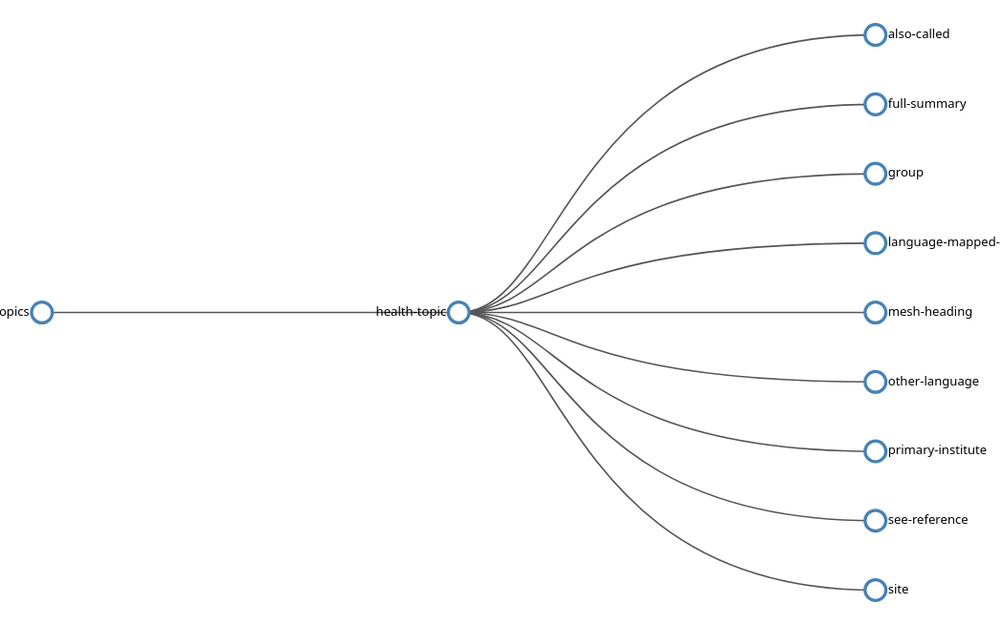
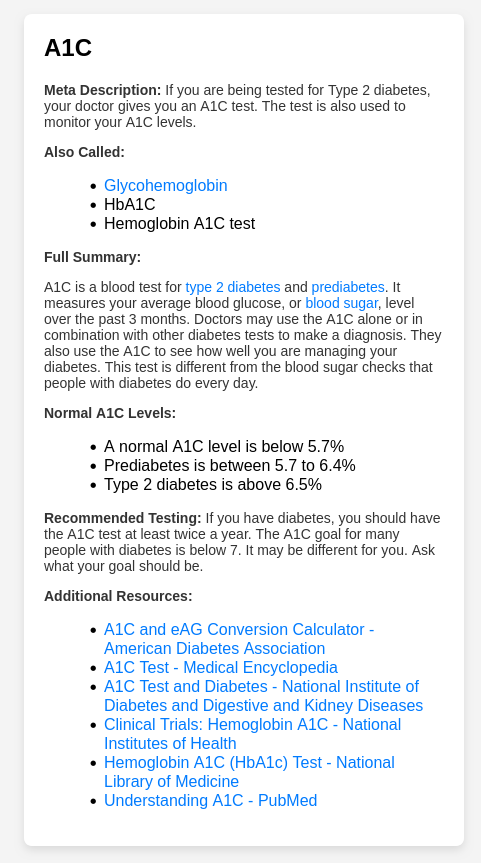

# CI-0124-TP1

## Build Instructions
1. Open a terminal on repo's root directory

1. Create a virtual environment
```bash
$ python3 -m venv venv
```

1. Activate virtual environment
```bash
$ source venv/bin/activate
```

1. Install requirements using pip
```bash
$ pip3 install -r requirements.txt
```

1. Run the program
```bash
$ python3 run.py
```

1. Open a browser and go to `http://localhost:3000/`

## Main page

1. General Dataset Information.

	1. `health-topics` count
	1. Dataset's date and time

1. Total number of references for the 10 most popular information categories.
	1. As a Matplotlib Pie Chart embedded image.

## Features

1. XML Tree Diagram



1. Summary cards



1. HTML Table

