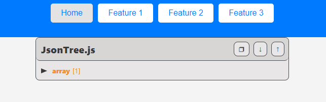

# CI-0124-TP1


## Build Instructions

Assuming that you use Linux or UNIX-like operating system:

1. Open a terminal on `TP1/Avance5` directory
1. Create a virtual environment
	```bash
	$ python3 -m venv venv
	```
1. Activate virtual environment
	```bash
	$ source venv/bin/activate
	```
1. Install requirements using pip
	```bash
	$ pip3 install -r requirements.txt
	```
1. Run the program
	```bash
	$ python3 run.py
	```
1. Open a browser and go to `http://localhost:3000/`


## Home page

1. General Dataset Information

	1. Dataset's date and time
	1. `health-topics` count


## Features

1. **Tree Diagram**  

Copy, close or open.




2. **Bar plot**

Total number of references for the 10 most popular information categories.
As a Matplotlib Pie Chart embedded image.


3. **HTML Table**  


